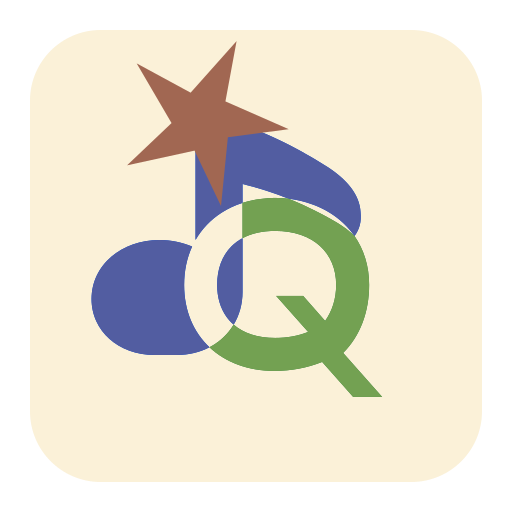

<p align="center">
  
</p>

# Quaver Music Astra

现代、美观的跨平台第三方 Q 音客户端，现已轻装上阵

<p align="center">
  
</p>

Quaver Music Astra，是一个基于 MyGO 的，以 Quaver Music 轻量化为目的的第三方 QQ 音乐客户端。以复用 Typhoeus Golang 后端，而非重复造轮子

Astra 名字取自《绝区零》角色耀嘉音（Astra Yao），也可以是《无畏契约》角色星礈（Astra），由于想名部想了半天，这个名字容易冲突，且能代表星星闪耀，该名字并不会成为 Quaver Music 开发代号。

- **UI**：[MyGo](https://github.com/egoist/mygo) 的原生 UI 工具包（`ui` 包）——视图是状态的函数，由 MyGo 在 GPU 上直接绘制（Linux 走 OpenGL），不开 WebKitGTK，窗口秒开、内存占用小。Linux GtkGLArea 渲染回调已固定在持有 GL context 的原生线程，避免 Go 调度迁移后 libepoxy 找不到当前 GLX/EGL context；检测到 NVIDIA 显卡时在加载 GL 前设置 `__GL_THREADED_OPTIMIZATIONS=0`。
- **后端**：[Typhoeus-go](https://github.com/Team-Quaver/typhoeus-go)（子模块 `third_party/Typhoeus-go`）**进程内嵌**——不再是 sidecar 独立进程，`quaver-server` 的完整路由表直接挂在本进程 `127.0.0.1` 的随机端口上。

> [!CAUTION]
> 真爱音乐，尊重正版，音乐平台不易，该应用**不提供盗版 QQ 音乐曲目服务！**

## 构建与运行

依赖：

- Go 1.27+（Linux 需 GTK3）
- **mpv**（播放必需）：`apt install mpv` / `dnf install mpv` / `brew install mpv`。设置 → 关于页会显示检测状态与实际路径；也可用 `QAA_MPV` 指定可执行文件。

```sh
git clone --recurse-submodules https://github.com/Team-Quaver/quaver-astra
cd quaver-astra
go build .
./quaver-astra
```

测试：

```sh
go test ./internal/...
QAA_TEST_MPV=1 go test -run TestEngineRealMPV ./internal/audio/   # 需要装mpv
```

CI 发布：每次 push 都会构建并发布一个带短 commit id 的 snapshot 预发布；`v*` tag 会发布对应版本。Linux AMD64/ARM64 为 AppImage（随包 Quaver Music 同款 mpv AppImage 运行时），LoongArch64 为二进制 tarball；Windows AMD64/ARM64 与 macOS ARM64 包含 mpv 官方 release 运行时。

环境变量（自检用）：

| 变量 | 作用 |
| --- | --- |
| `QAA_MPV` | 指定 mpv 可执行文件（绝对路径） |
| `QAA_MPV_DIR` | 随包 mpv 运行时目录（支持 quick-sharun、`mpv.app`、`mpv.exe` 与单文件布局） |
| `QAA_MPV_AO` | 强制音频输出（如 `null` 用于无声卡环境自检） |
| `QAA_MPV_DEVICE` | 强制音频输出设备 |
| `QAA_TEST_MPV=1` | 开启真实 mpv 往返测试 |
| `QAA_TEST_MPRIS=1` | 开启 MPRIS 往返测试（需会话 D-Bus + playerctl） |

mpv 定位优先级与 Quaver Music 本体（`ui/electron/audio/dist/bins.js`）一致：
显式路径 → 随包目录 → PATH。Linux 随包 mpv 是 AppImage 解包出的 quick-sharun
目录时，由包内 loader 按 `lib/lib.path` 直启 `shared/bin/mpv`，不继承宿主
`LD_LIBRARY_PATH`（避免包内 libc 与宿主 libc 混载）；Windows/macOS 直接启动
官方 release 的 `mpv.exe` / `mpv.app`。

## 功能（轻量版范围）

- 首页：今日精选 hero、新歌速递、推荐歌单网格
- 歌单详情：头部 + 歌曲列表，触底翻页、收藏歌单
- 搜索：歌曲 / 歌单两个 tab，热搜词、翻页
- 我喜欢 / 每日 30 首 / 猜你喜欢（换一批）
- **收藏的歌单**：我收藏的他人歌单网格、悬停播放、加载更多（登录态变化时自动重取）
- 登录：QQ / 微信 / 手机三通道扫码（自动生成 + 轮询），凭证加密保存、重启自动恢复
- 正在播放页：模糊封面底、**逐字（QRC）歌词**——逐字卡拉OK 高亮，无逐字时间轴时自动回退行级 + 翻译（点击跳转、跟随高亮）、音质胶囊
- 播放条：整条拖拽 seek、音量弹层、循环模式、随机播放（每日一套确定性顺序）、音质菜单（会话级切换）、红心收藏、队列面板（可拖拽排序）
- 播放队列：插队播放 / 加入队列 / 删除 / 清空；双击歌曲即播
- 封面动态取色：主题强调色随当前封面变化（含深浅色两套映射）
- 明暗主题跟随系统（可在设置里强制；强制值优先于桌面外观，见下）
- 设置页可分别选择界面字体与歌词字体：系统、衬线、非衬线、等宽或自定义 family list；歌词字体同时作用于行级歌词、翻译和逐字高亮
- **动效**：对齐主项目（桌面版 Quaver）的动效语言——正在播放页上滑开合、路由页错峰入场（route-in）、侧栏宽度过渡 + 收起图标旋转、行/卡片底色过渡、进度条缓动、逐字歌词每帧推进
- 侧栏可收起；收起态底部按钮纵向排列；侧栏几何有布局测试守护（图标列共线、行距均匀）；纯图标按钮均有 tooltip
- 系统托盘：对齐 Quaver Music 的曲目行、上一曲 / 播放暂停 / 下一曲、循环与随机、显示/隐藏、退出；单击/双击合并为一次显示/隐藏，右键弹出菜单；窗口关闭按钮可收进托盘
- **系统媒体控制中心**：Linux 注册 MPRIS2（`org.mpris.MediaPlayer2.quaver-astra`，桌面键盘媒体键、播放状态/封面/进度/循环模式双向同步），Windows 接入 SMTC（系统媒体浮层、媒体键、封面缩略图与进度时间轴，支持系统侧循环/随机切换）；架构见 `internal/smedia/`
- 播放音频时阻止系统睡眠（暂停/停止即恢复，不阻止熄屏）；正常退出、TERM/Ctrl+C 与 native SIGABRT 清理时都会终止 mpv；Linux 另设父进程死亡信号和进程组兜底，避免异常崩溃留下 mpv

## 架构

```
main.go                 启动：内嵌后端 → 配置 → MyGo 窗口
internal/backend/       quaver-server 进程内嵌 + HTTP 客户端（信封 {code,msg,data}）
internal/player/        播放器状态机（队列/模式/随机/回退链/歌词/收藏），与 UI 解耦
                        lyric.go = 行级 LRC 解析；qrc.go = 逐字 QRC 解码与解析
internal/audio/         mpv 子进程 + JSON IPC 引擎
                        bins.go = 二进制定位（显式/随包/PATH）+ 子进程环境
                        mpv.go  = 引擎（命令下发 / 属性观察 / 事件处理）
internal/smedia/        系统媒体控制中心投影（Linux MPRIS / Windows SMTC）
                        mpris.go        = D-Bus MPRIS2 服务（状态 diff + PropertiesChanged/Seeked）
                        smtc_windows.go = WinRT SMTC（裸 vtable 调用 + 纯 Go COM 事件对象，无 cgo）
internal/appui/         MyGo 原生 UI：外壳、侧栏、路由页、播放条、正在播放、队列
                        theme.go = 调色板与明暗判定；motion.go = 动效语言（缓动/错峰入场/逐字绘制）
internal/colorprobe/    封面主色提取 + 模糊底图
internal/vault/         登录凭证加密持久化（ChaCha20-Poly1305 + 随机主密钥）
internal/conf/          JSON 配置（quaver-astra.json）
```

播放链路：

```
player.startCurrent
  → backend /stream/resolve      解析音档 → 本地中继 URL
  → audio.OpenURL                mpv loadfile（mpv 自己发 Range / 重试）
  ← mpv observe_property         time-pos / duration / pause / eof-reached
  → player.tick                  同步位置、检测自然播完切下一首
```

自检钩子（开发用）：

- `QUAVER_ROUTE=<path>` 启动后导航到指定路由
- `QUAVER_SCREENSHOT=<png>` + `QUAVER_SCREENSHOT_DELAY=<秒>` 延时截图后退出
- `QUAVER_PLAY_FIRST=1` 自动播一首新歌（验证播放链路）
- `QUAVER_CONFIG_DIR=<dir>` 自定义配置目录

## 与主项目（Quaver Music）的差异

Astra 缺少以下内容：搜索联想、无歌单处理功能、无桌面快捷键。

**逐字歌词**：请求歌词时带 `qrc=1`，上游把 QRC 明文塞在同一个 `lyric` 字段里（XML 信封形态，Typhoeus-go 在服务端解密）。解析在 `internal/player/qrc.go`；服务端万一解密失败、原样透传密文，再由 [jixunmoe-go/qrc](https://github.com/jixunmoe-go/qrc) 在本地兜底解一层。

**明暗主题**：应用自己按 `Style.Theme` 定明暗，不依赖 MyGo 的 `Theme.IsDark()`——它的 Linux 后端 `SetSource("light")` 只清 GTK 的

## 许可

AGPL-3.0-Only（见 [LICENSE](LICENSE)）。第三方依赖见 go.mod；MyGo（MIT）、Typhoeus-go、jixunmoe-go/qrc（MIT，QRC 本地兜底解码）、mpv（LGPL-2.1+，作为外部进程调用）。
