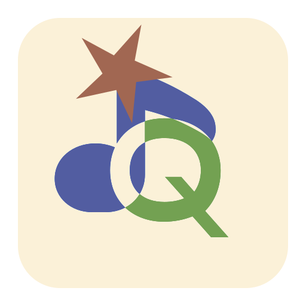
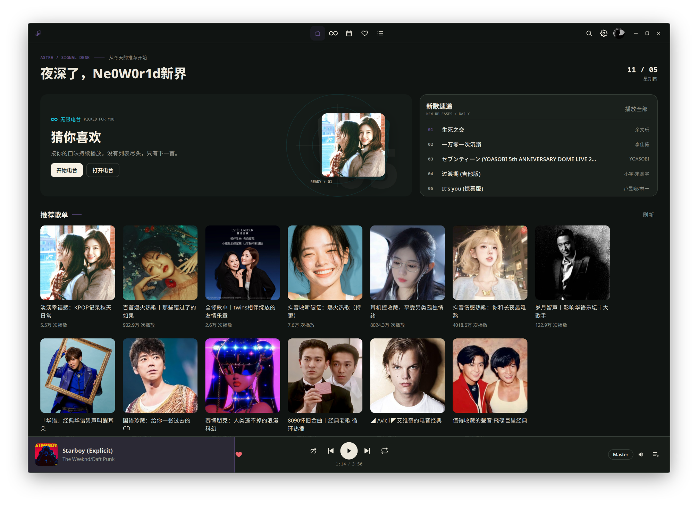

<p align="center">
  
</p>

# Quaver Music Astra

现代、美观的跨平台第三方 Q 音客户端，现已轻装上阵

<p align="center">
  
</p>

Quaver （Music） Astra，是一个基于 MyGO 的，使 Quaver Music 轻量化为目的的第三方 QQ 音乐客户端。以复用 Typhoeus Golang 后端，而非重复造轮子

Astra 名字取自《绝区零》角色耀嘉音（Astra Yao），也可以是《无畏契约》角色星礈（Astra），由于想名想了半天，这个名字容易冲突，且能代表星星闪耀

该名字并不会成为 Quaver Music 开发代号。

- **UI**：[MyGo](https://github.com/egoist/mygo) 的原生 UI 工具包（`ui` 包）——视图是状态的函数，由 MyGo 在 GPU 上直接绘制（Linux 走 OpenGL），不开 WebKitGTK，窗口秒开、内存占用小。已合并 MyGo 主线（增量绘制、文本测量缓存、局部布局重算、滚动惯性）；Linux GtkGLArea 渲染回调固定在持有 GL context 的原生线程，避免 Go 调度迁移后 libepoxy 找不到当前 GLX/EGL context；检测到 NVIDIA 显卡时在加载 GL 前设置 `__GL_THREADED_OPTIMIZATIONS=0`。
- **后端**：[Typhoeus-go](https://github.com/Team-Quaver/typhoeus-go)（子模块 `third_party/Typhoeus-go`）**进程内嵌**——不再是 sidecar 独立进程，`quaver-server` 的完整路由表直接挂在本进程 `127.0.0.1` 的随机端口上。
- **音频后端**：[Liino](https://github.com/Team-Quaver/liino)（子模块 `third_party/Liino`）**进程内嵌**，使用其 Native 模式：纯 Go（`CGO_ENABLED=0`）在 Astra 进程内完成解码 → DSP → 缓冲 → 系统输出，不启动 mpv 子进程。Linux 走 `decode/native`（ffgo 动态加载系统 FFmpeg）并输出到 PipeWire，Windows 优先 WMF + WASAPI，macOS 优先 AVFoundation + Core Audio。

> [!CAUTION]
> 真爱音乐，尊重正版，音乐平台不易，该应用**不提供盗版 QQ 音乐曲目服务！**

## 构建与运行

依赖：

- Go 1.27+（Linux 需 GTK3）
- **Liino 运行库**（播放必需）：
  - Linux：系统 FFmpeg 共享库（`libavformat` / `libavcodec` / `libavutil` / `libswresample`，装 `ffmpeg` 或发行版的 `ffmpeg-libs` 即可）与 PipeWire。设置 → 关于页会显示解码后端/输出驱动的自检结果。
  - Windows：Media Foundation（Windows N 版需 Media Feature Pack）+ WASAPI；遇到 WMF 解不了的容器时回退系统 FFmpeg DLL。
  - macOS：AVFoundation + Core Audio；同样在需要时回退系统 FFmpeg 动态库。
  - LoongArch64：Liino 的 ffgo 后端只覆盖 amd64/arm64，龙芯构建可以启动，但当前没有可用的解码后端（设置 → 关于会显示原因）。

```sh
git clone --recurse-submodules https://github.com/Team-Quaver/quaver-astra
cd quaver-astra
go build .
./quaver-astra
```

Windows 的图标与版本信息资源在 CI 里由
[go-winres](https://github.com/tc-hib/go-winres) 从 `winres/` 现场生成
（macOS 的 icns 同样在打包脚本里从 `img/app-icon.png` 现场缩放生成）。
本地构建 Windows 版想带图标时执行一次：
`go install github.com/tc-hib/go-winres@v0.3.3 && go-winres make --in winres/winres.json --out rsrc --arch amd64,arm64`。

测试：

```sh
go test ./internal/...
```

CI 发布：每次 push 都会构建并发布一个带短 commit id 的 snapshot 预发布；`v*` tag 会发布对应版本。Linux AMD64/ARM64 为 AppImage，并提供 DEB/RPM/Pacman（AMD64/ARM64/LoongArch64）；LoongArch64 另有二进制 tarball；Windows AMD64/ARM64 与 macOS ARM64 提供对应安装包。所有发行包按 AGPL-3.0-only 标记并附带 LICENSE。

> 说明：发行脚本目前仍沿用旧的 mpv 运行时暂存/随包逻辑；Astra 已经不再读取它，这部分属于待清理的历史包袱。DEB/RPM/Pacman 经由依赖（如 mpv/ffmpeg）间接带上 `libav*`，可满足 Liino 的 native 解码后端；AppImage 目前不随包 `libav*`，需要宿主装有 FFmpeg 共享库（发行包清理时再补这一步）。

环境变量（自检用）：

| 变量 | 作用 |
| --- | --- |
| `QAA_AUDIO_LOG=1` | 把 Liino/FFmpeg 的音频诊断日志打到 stderr（默认静音；拖动进度时 FLAC 的帧重同步告警属于预期行为） |
| `QAA_TEST_MPRIS=1` | 开启 MPRIS 往返测试（需会话 D-Bus + playerctl） |
| `QAA_SESSION_TYPE` | 覆盖会话类型判定（`wayland` / `x11`）：Wayland 下全局快捷键经 XDG GlobalShortcuts 门户注册、设置页不展示全局列，自检与测试据此切换这条分支 |
| `GITHUB_TOKEN` / `GH_TOKEN` | 可选的 GitHub token，仅用于更新检查，提升匿名 API 60 次/小时的限流 |

## 功能（轻量版范围）

- 首页：无限电台快速开始、新歌速递、推荐歌单、AI 歌单、排行榜分组
- 歌单页：我创建的歌单与收藏的歌单集中展示；顶部菜单不再重复铺歌单
- 歌单详情：头部 + 歌曲列表，触底翻页、收藏歌单
- 搜索：歌曲 / 歌单两个 tab，热搜词、翻页
- 我喜欢 / 每日 30 首
- **猜你喜欢 · 无限电台**：首轮 5 首，轮末自动续歌并裁掉历史；只向前播放，禁用上一首、插队、循环与随机，离开页面不打断
- 登录：QQ / 微信 / 手机三通道扫码（自动生成 + 轮询），凭证加密保存、重启自动恢复
- **个人中心**（点顶栏头像进入）：昵称、UID、当前档位，以及超级会员 / 豪华绿钻 / 绿钻**各自的到期时间**——三个档位是独立权益，到期日不同就不合并成一行；上游只给标志不给时间时如实写「未提供到期时间」。退出登录与「清除已保存的凭证」也收在这一页（原先埋在「设置 → 关于」最底下，点头像只会跳设置的人根本找不到）
- 正在播放页：左侧封面与元信息，右栏默认歌词；点「队列」标签，播放队列从右缘滑入取代歌词，点「歌词」再淡回来（播放条的队列钮同样切换右栏）
- 歌词：QQ 音乐 **QRC 逐字与振假名**，逐字高亮、翻译与音译辅助行；没有 QRC 时回退行级 LRC
- 歌词辅助行支持**关闭 / 翻译优先 / 音译优先**三档，缺首选那一路时自动回落另一路（点击跳转、跟随高亮）；播放条提供音质胶囊
- 播放条：底部细进度轨拖拽 seek（两端吸附到 0/1，支持 Home/End 与方向键）、音量弹层、循环模式、随机播放（每日一套确定性顺序）、音质菜单（会话级切换）、红心收藏、队列面板（可拖拽排序）；「回退到全景声」同时降权 7.1 与 5.1
- 播放队列：插队播放 / 加入队列 / 删除 / 清空；双击歌曲即播
- **会话记忆**：退出时保留播放列表、当前曲目、循环模式与随机开关，以及正在播放的进度（播放中每跨 5 秒节流落盘，切歌/暂停/seek/退出即时；崩溃最多丢 5 秒进度）。下次启动原地恢复但只「就位」——不自动连网、不自动起播，按播放键（含媒体键/托盘）从退出位置续播。落盘在 `quaver-astra.json` 的 `Session.Queue` / `Session.Pos` 两个键，队列快照与进度按当前曲 mid 对齐，进度跟错歌时作废、队列照恢复
- 封面动态取色：主题强调色随当前封面变化（含深浅色两套映射）
- 明暗主题跟随系统（可在设置里强制；强制值优先于桌面外观，见下）
- 设置页可分别选择界面字体与歌词字体：系统、衬线、非衬线、等宽或自定义 family list；歌词字体同时作用于行级歌词、翻译和逐字高亮
- **动效**：对齐主项目（桌面版 Quaver）的动效语言——正在播放页上滑开合、路由页错峰入场（route-in）、行/卡片底色过渡、进度条缓动、逐字歌词每帧推进
- **顶栏**：菜单栏横置顶部、只显示图标（功能名走 tooltip），无限电台用 ∞ 标记；搜索是按钮 + 浮窗；设置与头像在右侧；自绘 CSD 在非 macOS 右置，macOS 按 HIG 改为左侧交通灯；布局有测试守护（菜单居中、按钮共线、搜索浮窗）
- 系统托盘：对齐 Quaver Music 的曲目行、上一曲 / 播放暂停 / 下一曲、循环与随机、显示主窗口、退出；左键双击把程序拉回前台（单击不切换），右键弹出菜单；窗口关闭按钮可收进托盘
- **系统媒体控制中心**：Linux 注册 MPRIS2（总线名 `org.mpris.MediaPlayer2.QuaverAstra`，`DesktopEntry` 为应用 ID `red.0w0.quaver-astra`，桌面键盘媒体键、播放状态/封面/进度/循环模式双向同步），Windows 接入 SMTC（系统媒体浮层、媒体键、封面缩略图与进度时间轴，支持系统侧循环/随机切换），macOS 接入 Now Playing（`MPNowPlayingInfoCenter` + `MPRemoteCommandCenter`，控制中心/菜单栏正在播放卡片：标题/歌手/专辑/封面与进度，播放/暂停/上一首/下一首/拖动进度回传）。macOS 的系统投影只对带 `CFBundleIdentifier` 的应用生效，裸跑可能看不到，打包 `.app` 后正常；架构见 `internal/smedia/`
- **快捷键**（设置 → 快捷键）：全局与窗口内两套绑定，动作是播放/暂停、上一曲、下一曲、退出。全局默认 `Ctrl+Alt+P` / `Ctrl+Alt+←` / `Ctrl+Alt+→`（Windows `RegisterHotKey`、macOS Carbon 热键、Linux X11 由 Astra 抓键；Wayland 经 XDG GlobalShortcuts 门户注册，设置页不展示全局列，改键交给桌面）。窗口内默认与全局同键（全局不可用时顶上），另加退出 `Ctrl+Q`；点绑定格再按下组合键即改，Esc 取消，小叉解绑。两个作用域同键时全局优先（按键被系统截走，窗口收不到），同一动作在两个作用域同键不算冲突；媒体键只能作全局绑定；注册失败或与别的绑定撞车会在设置页标出来。
- 播放音频时阻止系统睡眠（暂停/停止即恢复，不阻止熄屏）；正常退出、TERM/Ctrl+C 与 native SIGABRT 清理时都会释放 Liino 的输出会话与解码线程
- **版本号**：「设置 → 关于」标题旁显示当前版本（优先取构建注入值，本地 `go build` 时回落到工作区的 git tag）
- **自动更新**：「设置 → 关于」可切换**稳定版**（GitHub latest API，最新正式 Release）与**快照版**（最近一次 push 的 `snapshot-*` 预发布）两个渠道，启动时自动检查（可关）。
  AppImage / 单文件二进制 / Windows 便携目录支持原地热替换（下载边算 sha256 校验 GitHub `digest`，同目录原子改名覆盖），系统包（deb/rpm/pacman）与 macOS `.app` 回退到打开发行页；发现新版本时只提示一次，可在设置页手动检查与下载安装

## 架构

```
main.go                 启动：内嵌后端 → 配置 → MyGo 窗口
internal/backend/       quaver-server 进程内嵌 + HTTP 客户端（信封 {code,msg,data}）
                        vip.go = 会员权益契约：档位顺序 + 只认各档 *_end 的到期解析
internal/player/        播放器状态机（队列/模式/随机/回退链/歌词/收藏），与 UI 解耦
                        lyric.go = 行级 LRC 解析；qrc.go = 逐字 QRC 解码与解析
internal/audio/         Liino 原生音频适配层（进程内解码 + 直连系统音频）
                        engine.go = 把 liino.Player 适配成 player.Engine（异步载入 / 时钟 / 事件）
                        status.go = 解码后端与输出驱动自检（设置 → 关于）
internal/smedia/        系统媒体控制中心投影（Linux MPRIS / Windows SMTC / macOS Now Playing）
                        mpris.go            = D-Bus MPRIS2 服务（状态 diff + PropertiesChanged/Seeked）
                        smtc_windows.go     = WinRT SMTC（裸 vtable 调用 + 纯 Go COM 事件对象，无 cgo）
                        nowplaying_darwin.go = MediaPlayer.framework 的 MPNowPlayingInfoCenter/MPRemoteCommandCenter
                        objc_darwin.go      = 无 cgo 的 Objective-C 桥（purego 动态发消息 + 主队列投递）
internal/appui/         MyGo 原生 UI：外壳、顶栏菜单、路由页、播放条、正在播放、队列、个人中心、快捷键
                        profile.go = 会员档位与各自到期时间的展示（时间口径见 backend/vip.go）
                        hotkeys.go = 全局（mygo.GlobalShortcut）与窗口内（ui.Context.Shortcut）两套绑定；
                                     waylandSession 判定 Wayland 会话后经门户注册，设置页不展示全局列
                        theme.go = 调色板与明暗判定；motion.go = 动效语言（缓动/错峰入场/逐字绘制）
internal/colorprobe/    封面主色提取 + 模糊底图
internal/vault/         登录凭证加密持久化（ChaCha20-Poly1305 + 随机主密钥）
internal/conf/          JSON 配置（quaver-astra.json）
internal/update/        自动更新：GitHub Releases 渠道/产物选择/下载校验/原地热替换
```

播放链路：

```
player.startCurrent
  → backend /stream/resolve      解析音档 → 本地中继 URL
  → audio.OpenURL                Liino 解码（ffgo/WMF/AVF 动态加载，自己发 Range / 重试）
  ← liino Events                 loaded / playing / buffering / ended / failed
  → player.tick                  读 Liino 高精度时钟同步位置、检测自然播完切下一首
```

自检钩子（开发用）：

- `QUAVER_ROUTE=<path>` 启动后导航到指定路由
- `QUAVER_SCREENSHOT=<png>` + `QUAVER_SCREENSHOT_DELAY=<秒>` 延时截图后退出
- `QUAVER_PLAY_FIRST=1` 自动播一首新歌（验证播放链路）
- `QUAVER_CONFIG_DIR=<dir>` 自定义配置目录

## 与主项目（Quaver Music）的差异

Astra 缺少以下内容：搜索联想、无歌单处理功能。桌面快捷键已实现：全局 + 窗口内两套绑定（Wayland 会话下全局快捷键经门户注册、设置页不展示全局列），见「设置 → 快捷键」。

**逐字歌词**：请求歌词时带 `qrc=1&trans=1&roma=1`，上游把 QRC 明文塞在同一个 `lyric` 字段里（XML 信封形态，Typhoeus-go 在服务端解密）。解析在 `internal/player/qrc.go`；服务端万一解密失败、原样透传密文，再由 [jixunmoe-go/qrc](https://github.com/jixunmoe-go/qrc) 在本地兜底解一层。`[kana:]` 振假名在 `internal/player/qrc_kana.go` 按全曲可注音字符流对齐；翻译与音译分别挂行，由 `player.AuxText` 按档位取一路。

**明暗主题**：应用自己按 `Style.Theme` 定明暗，不依赖 MyGo 的 `Theme.IsDark()`——它的 Linux 后端 `SetSource("light")` 只清掉 GTK 的 `gtk-application-prefer-dark-theme`，紧接着 `IsDark()` 又去问 XDG portal 的 `color-scheme`，深色桌面上「强制浅色」会被 portal 盖掉（darwin / windows 后端没有这一段）。所以对桌面说的 `SetSource` 只当「尽力而为」（让原生窗口底色与标题栏尽量跟上），真正的明暗一律看 `Style.Theme`。

## 许可

AGPL-3.0-Only（见 [LICENSE](LICENSE)）。第三方依赖见 go.mod；MyGo（MIT）、Typhoeus-go、Liino（AGPL-3.0，子模块）、jixunmoe-go/qrc（MIT，QRC 本地兜底解码）。
